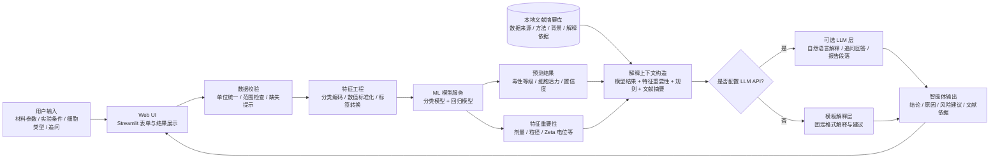
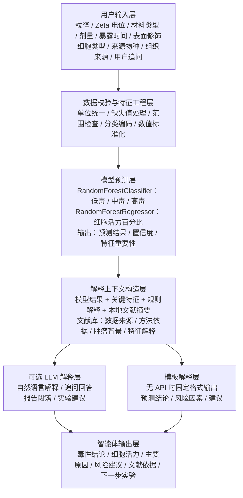

# 面向肿瘤纳米药物筛选的纳米材料毒性预测智能体：技术方案

## 1. 项目定位

本项目构建一个可运行的 Web 智能体原型，用于辅助评估候选纳米材料在体外细胞实验中的毒性风险。

推荐题目：

```text
面向肿瘤纳米药物筛选的纳米材料毒性预测智能体
```

边界定义：

- 肿瘤纳米药物是应用背景，用于说明项目价值。
- 核心 AI 任务是纳米材料细胞毒性预测。
- 预测对象是体外细胞实验结果，不是人体临床毒性。
- 系统不预测抗肿瘤疗效，也不做肿瘤分型或药效推荐。
- 机器学习模型负责预测，LLM 只负责解释、问答和报告生成。

## 2. 总体架构

系统采用轻量 Web 原型架构：

```text
用户输入层
→ 数据校验与特征工程层
→ ML 模型预测层
→ 解释上下文构造层
→ 可选 LLM 解释层
→ 智能体输出层
```

架构图：



浏览器演示版架构图：



关键约束：

- 毒性等级和细胞活力只能由 ML 模型输出。
- LLM 不参与预测决策，只负责解释、问答和报告式表达。
- 文献依据来自本地固定文献摘要库，不能由 LLM 临时编造。
- 未配置 LLM API 时，系统必须退回模板解释，保证原型可运行。

模块职责：

- `Web UI`：提供输入表单、预测按钮、结果展示、解释文本和图表展示。
- `Data Processor`：处理缺失值、单位统一、范围校验、分类变量编码和数值标准化。
- `Model Service`：加载训练好的分类模型和回归模型，输出毒性等级、细胞活力和置信度。
- `Explanation Engine`：根据特征重要性、规则和文献摘要构造解释上下文。
- `Optional LLM Layer`：把模型结果、规则解释和文献依据组织成自然语言回答。
- `Literature Base`：保存核心文献摘要，为报告引用和 LLM 解释提供可追溯依据。

## 3. 数据方案

推荐数据来源按优先级排序：

1. `eNanoMapper`
   - 用途：通用纳米材料安全与毒性数据。
   - 适合训练纳米材料理化性质到细胞毒性的预测模型。

2. `caNanoLab`
   - 用途：癌症纳米技术相关数据平台。
   - 适合支撑“肿瘤纳米药物筛选”的应用背景。

3. 已整理的纳米毒性机器学习数据集
   - 用途：如果原始数据库清洗难度较高，可作为第一版原型训练数据。
   - 原型阶段允许先使用结构化公开数据集，保证模型训练和演示可完成。

输入特征建议：

| 特征 | 类型 | 说明 |
| --- | --- | --- |
| 材料类型 / 组成 | 分类 | 金属、金属氧化物、聚合物、脂质体、碳基材料等 |
| 粒径 | 数值 | 单位 nm |
| Zeta 电位 | 数值 | 单位 mV |
| 表面修饰 / 包覆类型 | 分类 | PEG、柠檬酸盐、无修饰等 |
| 暴露剂量 | 数值 | 统一到同一浓度单位 |
| 暴露时间 | 数值 | 单位 h |
| 细胞类型 | 分类 | A549、BEAS-2B、HepG2 等 |
| 细胞来源物种 | 分类 | Human、Rat、Mouse 等 |
| 组织来源 | 分类 | Lung、Liver、Kidney 等 |
| 检测方法 | 分类 | MTT、LDH 等 |

输出标签：

- 回归任务：细胞活力百分比。
- 分类任务：低毒、中毒、高毒。

毒性等级阈值：

```text
细胞活力 >= 80%：低毒
50% <= 细胞活力 < 80%：中毒
细胞活力 < 50%：高毒
```

该阈值用于课程原型和报告说明。正式研究中应根据具体实验标准或文献定义调整。

## 4. 模型方案

第一版模型：

- `RandomForestClassifier`：预测毒性等级。
- `RandomForestRegressor`：预测细胞活力。

可选对比模型：

- `DecisionTree`：作为可解释性较强的基线。
- `XGBoost`：作为性能对比模型。
- `Logistic Regression / Linear Regression`：作为简单 baseline。

评估指标：

| 任务 | 指标 |
| --- | --- |
| 分类 | Accuracy、Precision、Recall、F1、Confusion Matrix |
| 回归 | MAE、RMSE、R² |
| 解释 | Feature Importance |

训练流程：

```text
读取公开数据
→ 清洗字段和单位
→ 处理缺失值
→ 编码分类变量
→ 标准化数值变量
→ 划分训练集 / 测试集
→ 训练分类模型和回归模型
→ 评估模型
→ 保存模型与预处理器
```

## 5. 智能体交互方案

用户输入示例：

```text
粒径：90 nm
Zeta 电位：-8 mV
材料类型：脂质体
剂量：50 μg/mL
暴露时间：24 h
表面修饰：PEG
细胞类型：A549
```

系统输出示例：

```text
预测毒性等级：低毒
预测细胞活力：85%
置信度：0.91

主要依据：
剂量、粒径、Zeta 电位是影响预测的关键因素。

解释：
当前样本剂量处于中等水平，PEG 表面修饰可能降低非特异性细胞相互作用，因此模型判断毒性风险较低。

建议：
可优先进入下一轮体外验证，并补充正常细胞系如 BEAS-2B 进行对照。
```

智能体能力包括：

- 毒性预测：根据输入参数输出等级和细胞活力估计。
- 结果解释：说明哪些特征影响了预测。
- 风险建议：给出降低毒性或补充验证的建议。
- 文献依据：说明解释来自哪些本地文献摘要。
- 追问回答：回答“为什么粒径重要”“为什么不需要人体数据”等问题。

## 6. 可选 LLM 层

LLM 层是可选增强模块。没有 LLM API 时，系统必须能通过模板解释正常运行。

LLM 输入：

- 模型预测结果。
- 当前样本参数。
- 特征重要性。
- 规则解释。
- 本地文献摘要。

LLM 输出：

- 自然语言解释。
- 实验建议。
- 报告式总结。
- 对用户追问的回答。

LLM 禁止事项：

- 不允许直接决定毒性等级。
- 不允许编造模型指标。
- 不允许编造数据来源。
- 不允许替代模型训练、评估和特征重要性分析。

推荐实现：

```text
if LLM_API_KEY exists:
    使用 LLM 生成自然语言解释
else:
    使用模板生成解释
```

## 7. 核心文献建议

文献库保存为 `literature/literature_base.json` 或 Markdown 表格。每篇文献至少包含标题、年份、用途、关键结论和可引用链接。

推荐核心文献：

1. `The eNanoMapper database for nanomaterial safety information`
   - 用途：数据来源依据。
   - 支撑点：eNanoMapper 面向纳米材料安全数据，适合纳米毒性和 NanoQSAR / ML 数据管理。

2. `Predicting Cytotoxicity of Nanoparticles: A Meta-Analysis Using Machine Learning`
   - 用途：模型任务、特征选择、随机森林方法依据。
   - 支撑点：纳米颗粒细胞毒性可用机器学习预测，材料组成、浓度、Zeta 电位、粒径和暴露时间是关键特征。

3. `Application of Machine Learning in Nanotoxicology: A Critical Review and Perspective`
   - 用途：ML 用于纳米毒性预测的综述依据。
   - 支撑点：机器学习能辅助纳米毒性预测，但存在数据量有限、数据异质性和可解释性挑战。

4. `caNanoLab: data sharing to expedite the use of nanotechnology in biomedicine`
   - 用途：肿瘤纳米技术数据平台和应用背景依据。
   - 支撑点：caNanoLab 可支撑癌症纳米技术相关数据背景。

5. `AI and Machine Learning Approaches for Predicting Nanoparticles Toxicity: The Critical Role of Physiochemical Properties`
   - 用途：理化性质特征选择依据。
   - 支撑点：粒径、形状、表面电荷、材料组成和暴露条件是纳米毒性预测的重要输入。

6. `Smart Drug-Delivery Systems for Cancer Nanotherapy`
   - 用途：肿瘤纳米药物应用背景。
   - 支撑点：纳米药物在癌症治疗中具有应用价值，同时需要关注安全性和毒性风险。

文献摘要库示例：

```json
{
  "title": "Predicting Cytotoxicity of Nanoparticles: A Meta-Analysis Using Machine Learning",
  "used_for": ["模型选择", "特征选择", "结果解释"],
  "key_points": [
    "机器学习可用于预测纳米颗粒细胞毒性",
    "材料组成、浓度、Zeta 电位、粒径、暴露时间是常见重要特征",
    "随机森林适合用于细胞活力预测和特征重要性分析"
  ]
}
```

## 8. 技术栈

推荐技术栈：

- Python
- pandas / numpy
- scikit-learn
- xgboost，可选
- joblib
- Streamlit
- matplotlib / seaborn
- OpenAI / DeepSeek / 本地模型 API，可选

UI 推荐使用 `Streamlit`。它适合课程展示，能快速提供输入控件、图表、文本解释和模型调用。

## 9. 项目结构

```text
nano-tox-agent/
├── data/
│   ├── raw/
│   └── processed/
├── literature/
│   └── literature_base.json
├── models/
│   ├── toxicity_classifier.joblib
│   └── viability_regressor.joblib
├── src/
│   ├── data_loader.py
│   ├── preprocess.py
│   ├── train.py
│   ├── predict.py
│   ├── explain.py
│   └── llm_layer.py
├── app.py
├── requirements.txt
└── report/
```

## 10. 最终交付物

最终交付物：

- 可运行 Web 原型。
- 数据清洗与训练代码。
- 训练好的模型文件。
- 模型评估结果。
- 文献摘要库。
- 示例预测结果。
- 可复用到课程报告 / PPT 的架构图和方法说明。

验收标准：

- 用户能在 Web 页面输入纳米材料参数并得到预测结果。
- 系统能解释主要风险因素。
- 系统能在无 LLM API 时输出模板解释。
- 系统能在有 LLM API 时输出更自然的报告式解释。
- 预测结果来自训练模型，不由 LLM 直接生成。
- 文献依据来自本地固定文献库，可追溯到具体条目。
